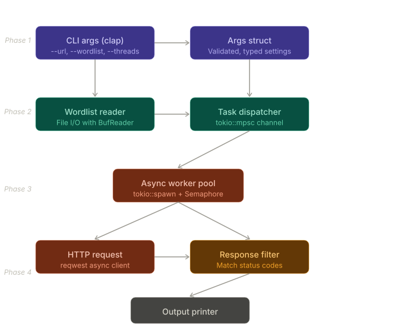

# Siege

A CLI web fuzzer that takes a URL with a placeholder (like FUZZ), a wordlist file, and fires off concurrent HTTP requests — reporting back which URLs return interesting status codes.

> Work in progress. Built for learning purposes.

## Architecture Overview



## Crates

| Crate | Purpose | Phase |
|---|---|---|
| `clap` | CLI argument parsing | 1 |
| `thiserror` | Custom error types | 1 |
| `tokio` | Async runtime | 3 |
| `reqwest` | HTTP client | 3 |
| `colored` | Terminal colors | 4 |
| `indicatif` | Progress bar | 4 |

## Structure

```
siege/
├── Cargo.toml
└── src/
    ├── main.rs       - entry point, wires everything together
    ├── cli.rs        - clap config, Config struct
    ├── wordlist.rs   - file reading, URL building
    ├── runner.rs     - async engine, task dispatch // TODO
    ├── http.rs       - fetch logic, FuzzResult struct
    ├── output.rs     - Printer trait + implementations
    └── info.rs       - Print banner and information
```