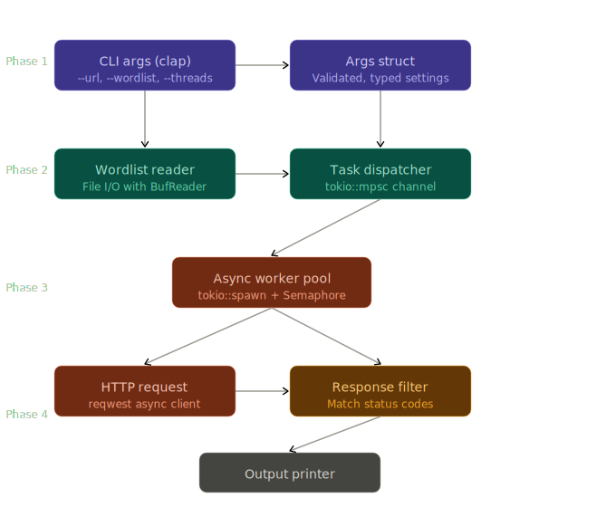

# Siege

A CLI web fuzzer that takes a URL with a placeholder (like FUZZ), a wordlist file, and fires off concurrent HTTP requests — reporting back which URLs return interesting status codes.


## Architecture Overview



## Crates

| Crate | Purpose | Phase |
|---|---|---|
| `clap` | CLI argument parsing | 1 |
| `thiserror` | Custom error types | 1 |
| `tokio` | Async runtime | 3 |
| `reqwest` | HTTP client | 3 |
| `colored` | Terminal colors | 4 |
| `indicatif` | Progress bar | 4 |

## Structure

```
ruster/
├── Cargo.toml
└── src/
    ├── main.rs       - entry point, wires everything together
    ├── cli.rs        - clap config, Config struct
    ├── wordlist.rs   - file reading, URL building
    ├── runner.rs     - async engine, task dispatch
    ├── http.rs       - fetch logic, FuzzResult struct
    ├── output.rs     - Printer trait + implementations
    └── error.rs      - custom error type
```

## Build Stages

### Stage 1 - Skeleton & CLI arguments

> Concepts: structs, enums, `Result`/`Option`, CLI with `clap`

Build the `Config` struct and parse arguments.

Pseudo:
```rust
struct Config {
    url: String,          // e.g. "https://target.com/FUZZ"
    wordlist: PathBuf,    // path to wordlist file
    threads: usize,       // concurrency level (default 50)
    filter_codes: Vec<u16>, // status codes to show (default [200,301,302])
    timeout: u64,         // request timeout in seconds
}

fn parse_args() -> Result<Config, Error> {
    // use clap to define flags
    // validate: does URL contain "FUZZ"?
    // validate: does wordlist file exist?
    // return Config or a descriptive error
}
```

### Stage 2 - Wordlist I/O & URL building

> Concepts: File I/O, iterators, ownership, `String` manipulation

Pseudo:
```rust
fn load_wordlist(path: &Path) -> Result<Vec<String>, Error> {
    // open file with BufReader (efficient, doesn't load entire file at once)
    // iterate lines
    // skip empty lines and comments (#)
    // collect into Vec<String>
}

fn build_url(template: &str, word: &str) -> String {
    // replace "FUZZ" in template with word
    // template.replace("FUZZ", word)
}
```

### Stage 3- Async engine

> Concepts: `async/await`, `tokio`, channels, `Arc`, `Semaphore`

`Arc` for shared ownership across threads, `Semaphore` for concurrency control, `tokio::spawn`, `async move` closures, channel patterns.

Pseudo:
```rust
async fn run(config: Config, words: Vec<String>) {
    // create shared HTTP client (Arc<reqwest::Client>)
    // create semaphore to limit concurrent tasks (Arc<Semaphore>)
    // create mpsc channel: sender → workers, receiver → printer

    for word in words {
        let url = build_url(&config.url, &word);
        let client = Arc::clone(&client);
        let sem = Arc::clone(&semaphore);
        let tx = sender.clone();

        tokio::spawn(async move {
            let _permit = sem.acquire().await;   // blocks if at thread limit
            let result = fetch(client, url).await;
            tx.send(result).await;               // send to output channel
        });
    }
    // drop sender so receiver knows when done
}

async fn fetch(client: Arc<Client>, url: String) -> FuzzResult {
    // make GET request
    // return FuzzResult { url, status, size, duration }
}
```

### Stage 4 - Output, filtering & polish

defining and implementing traits, `match` with guards, `Display` trait for custom formatting, `colored` crate for terminal colors.

```rust
enum OutputMode { Pretty, Json, Silent }

trait Printer {
    fn print(&self, result: &FuzzResult);
    fn print_summary(&self, total: usize, found: usize, elapsed: Duration);
}

// filter logic
fn should_display(result: &FuzzResult, config: &Config) -> bool {
    match result.status {
        s if config.filter_codes.contains(&s) => true,
        _ => false,
    }
}
```
